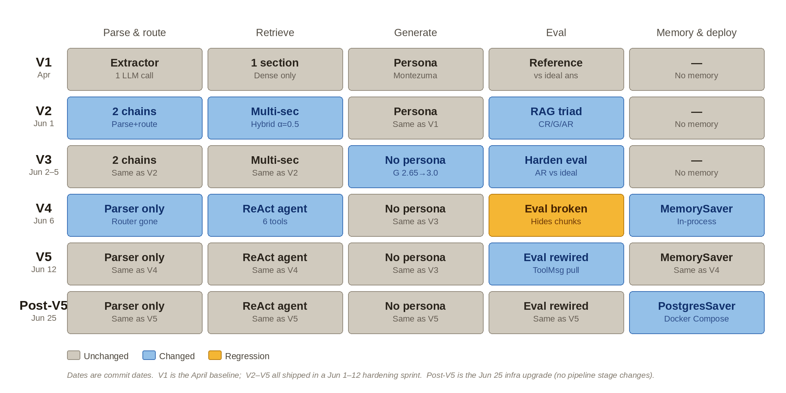
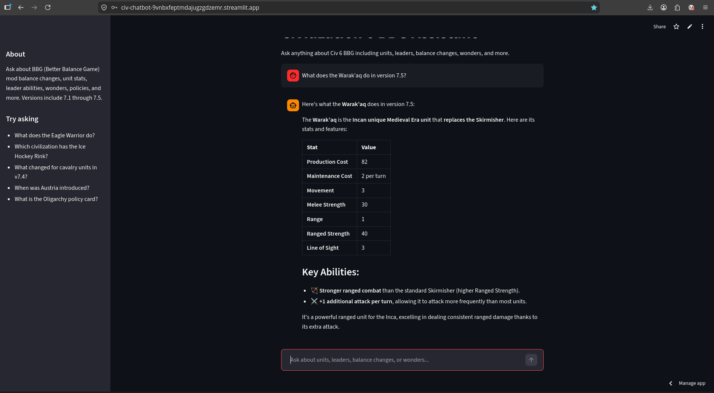
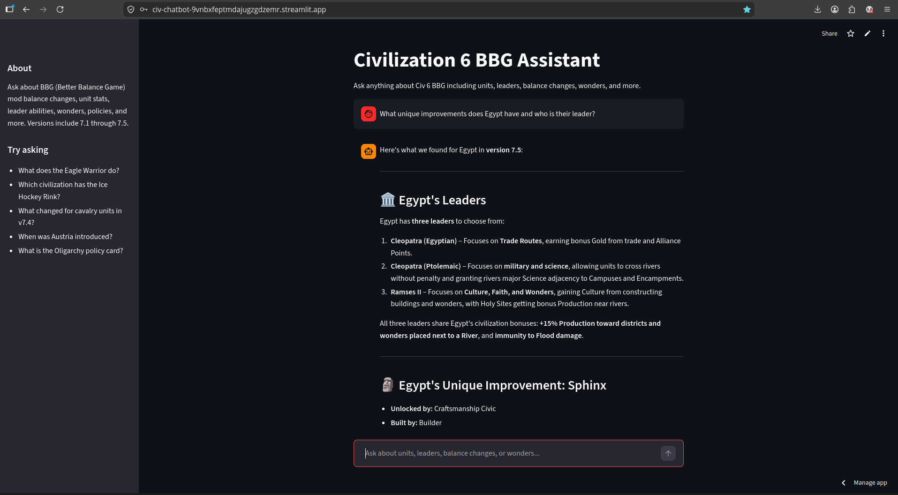
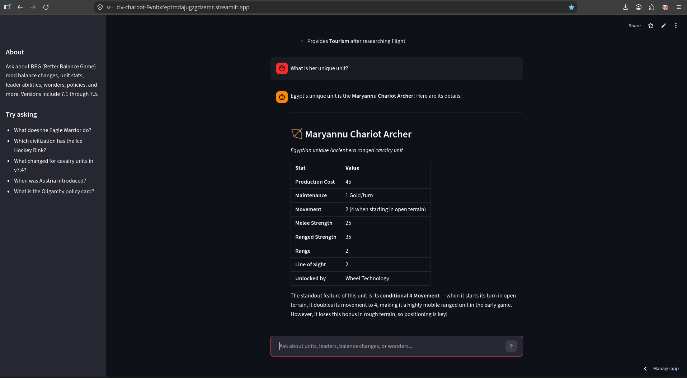
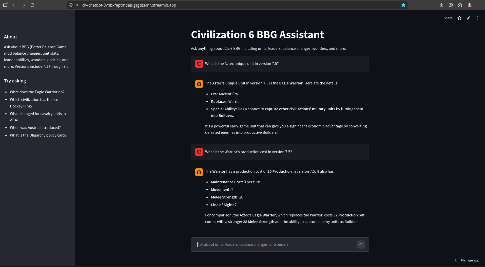

# RAG Pipeline: Civilization 6 Domain

A production-grade, agentic RAG system that answers questions about the Better Game Balance (BBG) mod for Civilization VI (unit stats, leader abilities, balance changes across versions, wonders, policies, and more), with full awareness of which BBG version introduced or changed something. It evolved from a single-call extractor on a local vector store into a ReAct agent with hybrid retrieval and persistent conversation memory, with every major change measured against a RAG triad evaluation harness rather than judged by eye.

🟢 **Live app:** [civ-chatbot-9vnbxfeptmdajugzgdzemr.streamlit.app](https://civ-chatbot-9vnbxfeptmdajugzgdzemr.streamlit.app/) *(password required)*

☁️ **Also deployed on AWS** as a container-image Lambda behind API Gateway with inference on Amazon Bedrock, Terraform-managed in [`infra/`](infra/). Endpoint available on request: `POST /query` requires a shared-secret `X-API-Key` header and every request costs tokens, so neither the URL nor the key is published here.

Live demo requires password due to API costs; screenshots at the bottom.

---

## How it works

1. **Scraping**: BeautifulSoup scrapers pull data from the BBG patch notes pages across all supported versions (`v7.1` through `v7.5`, plus `base_game`), covering units, leaders, buildings, wonders, policies, great people, changelogs, and more.
2. **Ingestion**: Scraped entries are embedded with OpenAI's `text-embedding-3-small` model (dense vectors) and encoded with a fitted BM25 encoder (sparse vectors). Both are upserted together into a Pinecone cloud vector database per record, in batches with structured JSON logging and per-batch error handling so a single failure doesn't kill the run.
3. **Query parsing**: At query time, a Claude-powered Query Parser cleans the user's question (fixing typos, removing explicit version references) and extracts the target BBG version. Version context is injected into the agent's input for use in tool calls.
4. **Agentic retrieval**: A ReAct agent receives the cleaned query and reasons at runtime about which search tools to call. Six tools cover the main content sections (units, leaders, great people, techs & civics, buildings & improvements, and a general catch-all). Each tool issues a hybrid query combining dense semantic search and BM25 sparse keyword search; the dense and sparse vectors are alpha-weighted (`ALPHA = 0.5`) and combined in a single Pinecone hybrid query, with version and section metadata filters applied per call. The agent can call multiple tools in sequence when a question spans sections.
5. **Generation**: The agent synthesizes retrieved results into a response grounded in the source data.
6. **Memory**: Conversation state is persisted across turns and restarts via a `PostgresSaver` checkpointer backed by Postgres, and there is **no in-memory fallback in production code**. An unset or unreachable `DATABASE_URL` raises and the service refuses to start, because a degraded memory-only deployment is one that has stopped persisting anything while still looking healthy. Tests and the eval runner are single-turn and pass no checkpointer at all rather than relying on a fallback. Each Streamlit session gets its own `thread_id` so context carries through a session; a new session starts fresh. (`thread_id` persistence across sessions via cookie or query param is the noted next step.)
7. **Evaluation**: Every architecture change is measured against a RAG triad eval harness: context relevance (did retrieval surface the right chunks?), groundedness (is the response supported by those chunks?), and answer relevance (does it answer the question?), three independent LLM-as-judge evaluators scored against a fixed question set.
8. **UI**: A Streamlit app serves the chatbot with per-session thread tracking, a sidebar with an About section and example questions.

---

## Architecture evolution

The pipeline went through four rewrites to get here, each driven by a measured failure rather than a preference: a single-call extractor became a parser plus a router, dense-only retrieval became hybrid, the router was deleted in favor of an agent choosing its own tools, and a reference-based eval became the RAG triad. The diagram tracks five pipeline stages across those changes; gray means a stage carried over unchanged, blue means a deliberate architecture decision.



[`docs/architecture.md`](docs/architecture.md) carries the reasoning rather than the chronology: [what the system is today](docs/architecture.md#the-system-today), [the decisions and what each one cost](docs/architecture.md#decisions), [what measurement caught that review didn't](docs/architecture.md#what-measurement-caught-that-review-didnt), and [the gaps that are still open](docs/architecture.md#known-gaps-stated-plainly).

**Current eval scores** (RAG triad, 15 questions):

| Metric | Score |
|---|---|
| Context relevance | 3.00 |
| Groundedness | 2.73–2.93 |
| Answer relevance | 2.93 |

Groundedness is a range rather than a point because generation is not temperature-pinned, so the same eval re-run moves within that band at n=15. Reporting a single number for it would be quoting one run. The earlier reference-based scores are not comparable to these and are not reproduced here: they measured responses against ideal answers rather than against retrieved chunks, which is precisely the blind spot the triad was built to close.

---

## Model choice

The agent model is Claude Sonnet 4.6. The swap was motivated by a class of confidently wrong answers (Civ 5 values substituted for BBG ones), first read as a training prior overriding retrieval. A later trace-level re-investigation corrected that root cause: the canonical case was a **tool-routing bug**, since `search_leaders`'s docstring advertised unique units while unit records live in the `units` section, so the right chunk was never retrieved at all. The fix is one docstring line, and it is model-independent, holding on Haiku 4.5 as well.

What the measurement does support is grounding: probes built on facts where this corpus diverges from vanilla Civ 6 ground 12 of 12 through the pipeline against 0 of 12 from the raw model. On the RAG triad the two builds are a wash (Sonnet agentic re-runs score G 2.73–2.93 against the deterministic baseline's 2.80 at n=15), so the model decision rests on cost versus flexibility rather than groundedness; Sonnet is 3x Haiku per token. The full investigation, including the revert that was considered and superseded by measurement, is in [`docs/architecture.md`](docs/architecture.md#the-regression-i-announced-a-revert-for-was-a-one-line-bug); the probe scripts are in `evaluation/`.

---

## Project structure

```
Dockerfile                  # Single-container image (uv, lockfile-first layer caching, serve extra only)
Dockerfile.lambda           # AWS Lambda container image (api extra into /var/task, NLTK corpora baked in)
docker-compose.yml          # Three services: app (Streamlit client) + api (FastAPI) + db (postgres:16), named volume for persistence
infra/                      # Terraform for the AWS deploy: ECR, IAM, Lambda, API Gateway, plus deploy.sh
src/
├── scraping/           # One scraper per BBG data section
│   ├── scrape_orchestrator.py  # Runs all scrapers
│   ├── scrape_units.py
│   ├── scrape_leaders.py
│   ├── scrape_changelogs.py
│   └── ...
├── ingestion/
│   └── ingester.py     # Embeds scraped data, fits BM25 encoder, upserts into Pinecone
├── retrieval/
│   ├── retriever.py        # hybrid_query: dense + sparse search via Pinecone
│   └── version_extractor.py  # Query Parser: cleans query, extracts version
├── agent/
│   ├── tools.py             # Six search tools wrapping hybrid_query with section filters
│   └── construct_agents.py  # ReAct agent construction with a Postgres-only checkpointer (raises when DATABASE_URL is unset or unreachable; no in-memory fallback)
├── schema.py             # UnifiedEntry, ParsedQuery
├── config.py             # Version/Section enums, model names, retrieval constants
├── logging_config.py     # Structlog configuration: shared logger for structured JSON output
├── utils.py              # format_docs helper
├── secrets.py            # Reads from st.secrets (cloud) or .env (local)
├── response_generator.py # Pipeline entry point: query parsing + agent invocation
└── api.py                # FastAPI service (POST /query, GET /health) + Mangum handler for Lambda
evaluation/              # RAG triad eval pipeline
├── eval_runner.py              # Runs RAG triad eval across question set
├── schema.py                   # PartialJudgment and Judgment types
├── context_relevance_judge.py  # Did retrieval surface the right chunks?
├── grounding.py                # Is the response supported by retrieved chunks?
└── answer_relevance.py         # Does the response answer the question?
models/
└── bm25_values.json    # Fitted BM25 encoder, generated at ingestion time
app.py                  # Streamlit UI
```

---

## Querying

The chatbot understands version-specific, cross-version, and multi-section questions:

| Query | Behaviour |
|---|---|
| "What does the Eagle Warrior do?" | Searches BBG v7.5 (latest) |
| "What did the Knight cost in v7.1?" | Filters to v7.1 |
| "Which versions have the Eagle Warrior?" | Searches across all versions |
| "Which civilization has the Ice Hockey Rink?" | Agent calls both improvements and leaders tools |
| "What is her unique unit?" | Memory resolves prior context, no need to restate |

---

## HTTP API

The pipeline is also exposed as a FastAPI service (`src/api.py`), so the RAG backend can be called over HTTP independently of the Streamlit UI:

```bash
uv run --extra api uvicorn src.api:app --port 8000
```

- `GET /health` returns `{"status": "ok"}`. Open, and genuinely dependency-free: it touches neither the database nor the model, so it is a true liveness probe and **not** a warm-up.
- `POST /warm` (requires `X-API-Key`) builds the agent and opens the database connection without spending model tokens. This is the warm-up, and the Streamlit client pings it once per authenticated session.
- `POST /query` (requires `X-API-Key`) with `{"query": "...", "thread_id": "...", "history": []}` returns `{"response": "...", "documents": [...]}`. `thread_id` selects the conversation thread for memory; interactive docs are at `/docs`.

The agent and its Postgres-backed checkpointer are built once per process by a lazy singleton (`get_agent()`) over a `psycopg` connection pool, so concurrent requests each borrow their own connection. **Every surface uses that one construction path** — local uvicorn, Docker Compose, and Lambda alike. On Lambda this means the agent and pool are reused for the container's lifetime rather than rebuilt per request, which is why `handler = Mangum(app, lifespan="off")`: Mangum runs an ASGI lifespan per *invocation*, not per container, so leaving it on would tear down the singleton after every request. The pool runs `min_size=0` so an idle warm container parks no database connection; details in [`docs/architecture.md`](docs/architecture.md#serverless-outside-a-vpc).

---

## Re-ingestion

`ingester.py` is an admin-only local script. If you modify any scraper, the `generate_embedding_text()` method in `schema.py`, or add a new BBG version to the `Version` enum, re-run the ingester to push updated vectors to Pinecone:

```bash
uv run --extra ingest python -m src.ingestion.ingester
```

The ingester upserts by ID (the entry's content hash), so a re-run is a full idempotent rebuild rather than a delta: a record whose hashed content is unchanged keeps its ID and overwrites itself, and a genuinely new record is inserted under a new ID.

The gap worth knowing is that the pipeline **never deletes**. Pure additions and metadata-only edits are clean, but an edit to a hashed field (section, name, or description) lands under a new ID while the old vector stays live with its original `bbg_version` list, so a version-filtered query can retrieve both the old and the new fact. A removal leaves an orphan. Until ID-diff pruning exists, clear the Pinecone index before re-ingesting if you have edited or removed content; adding content alone needs no clear. See [`docs/architecture.md`](docs/architecture.md#the-system-today) for the mechanism.

The ingester also re-fits the BM25 encoder on the full corpus and overwrites `models/bm25_values.json`. Commit the updated file after re-ingesting.

**To add a new BBG version:** add the new version as the first entry in the `Version` enum in `config.py`. The scraper and ingester pick it up automatically on next run.

---

## Deployment

The app and its Postgres memory store run as two Docker Compose services:

```bash
# Requires Docker Desktop (or Docker Engine + Compose plugin)
# Copy .env.example to .env and fill in keys before running
docker compose up
```

Compose brings up three services, mirroring the production topology rather than a different one: `db` (Postgres), `api` (the FastAPI backend, which is what talks to Postgres), and `app` (the Streamlit frontend, which talks only to `api` over HTTP). `api` waits for the `db` healthcheck (`pg_isready`) and `app` waits for `api`'s. Conversation memory is written to a named Postgres volume (`pgdata`) and survives `docker compose restart`; it is only dropped with `docker compose down -v`.

The `app` service deliberately gets an explicit `environment:` block with only `APP_PASSWORD`, `API_SHARED_SECRET` and `API_BASE_URL`, rather than `env_file: .env`. Loading the env file there would inject Anthropic, OpenAI and Pinecone keys into the frontend container, which is exactly the credential surface the consolidation removed. `app` has no `DATABASE_URL` and no `psycopg` in its image.

The `db` service is a co-located Compose service, not a Kubernetes sidecar (which is a stateless helper sharing an app's pod). In production it would be replaced by a managed Postgres (RDS / Cloud SQL / Azure Database for PostgreSQL), selected by the same `DATABASE_URL` with no code change; `docker-compose.yml` is a local-dev convenience, while the portable artifact is the `Dockerfile` image.

### AWS serverless deploy

The same FastAPI service also runs on AWS as a **container-image Lambda behind an API Gateway HTTP API**, with inference served by **Amazon Bedrock** (Claude Sonnet 4.6, via the `global.anthropic.claude-sonnet-4-6` inference profile) rather than the Anthropic API. Infrastructure is Terraform-managed in `infra/`: an ECR repository with a lifecycle policy, the Lambda execution role with a Bedrock invoke policy scoped to that one model, a CloudWatch log group with retention, the function itself (built from `Dockerfile.lambda`, x86_64, 2048 MB), and the HTTP API with `GET /health`, `POST /warm`, and `POST /query` routes.

```bash
cd infra
cp terraform.tfvars.example terraform.tfvars   # fill in secrets
terraform init
./deploy.sh                                    # build, push to ECR, terraform apply
```

Which provider is used is selected at runtime by `LLM_PROVIDER`, and only the Lambda sets it to `bedrock`; Streamlit Community Cloud and local development continue to use the direct Anthropic client. The function runs **outside a VPC** deliberately, since a VPC-attached Lambda needs a NAT Gateway (roughly $32/month) to reach Neon, Pinecone, OpenAI, and Bedrock. Conversation memory is the same Neon Postgres the Streamlit deployment uses, so a `thread_id` is durable across both surfaces.

Cold starts have two regimes, and the variable is whether Lambda has already cached the container image, not how long the function sat idle. The first invocation after a new image is pushed has to fetch and unpack that image inside the init phase, which blows Lambda's hard 10s init cap and re-runs initialization inside the invoke, for a cold `/health` of 23–24s. Once the image is cached, init runs 5.5–6.4s for a cold `/health` of 6.5–7.7s, and that number is flat from five minutes of idle out to 16.3 hours. API Gateway caps its integration timeout at 30 seconds, so only the post-push regime can return a 504 while the function runs to completion and stays warm; the demo protocol is therefore to call `POST /warm` first, then `/query`. (`/health` was the warm-up until construction moved out of the FastAPI lifespan, which made it dependency-free and therefore useless for warming.) Warm latency is about 51ms for `/health` and about 9s for `/query`, with a follow-up on the same thread around 3s. The measurements, the rejected alternatives, and the two failures that appeared only once deployed are in [`docs/architecture.md`](docs/architecture.md#serverless-outside-a-vpc).

**Environment variables** (injected at runtime, never baked into the image; the `api` service reads them via `env_file: .env` with `DATABASE_URL` set in its Compose `environment:` block, while the `app` service gets only the three frontend values listed below the table):

| Variable | Purpose |
|---|---|
| `ANTHROPIC_API_KEY` | Claude API (query parsing, generation, eval judges). Not required when `LLM_PROVIDER=bedrock` |
| `LLM_PROVIDER` | `bedrock` selects `ChatBedrockConverse`; unset or anything else uses the Anthropic API (the default) |
| `BEDROCK_MODEL_ID` | Bedrock inference profile id, read only when `LLM_PROVIDER=bedrock` |
| `OPENAI_API_KEY` | Embedding model (`text-embedding-3-small`) |
| `PINECONE_API_KEY` | Vector database |
| `PINECONE_INDEX_NAME_V2` | Pinecone index name for the hybrid (dense + sparse) index |
| `DATABASE_URL` | Postgres connection string, e.g. `postgresql://civ:civ@db:5432/civ` |
| `APP_PASSWORD` | Password gate for the Streamlit UI |

Secrets are excluded from the image via `.dockerignore`. `DATABASE_URL` is **required** wherever the pipeline runs: unset or unreachable, `build_checkpointer()` raises and the service refuses to start rather than degrading to in-memory state. Every local surface therefore needs Postgres running.

**The frontend holds none of the above.** Since the surface consolidation, the Streamlit app is a thin HTTP client of the API and its entire configuration is `APP_PASSWORD`, `API_SHARED_SECRET`, and `API_BASE_URL`. The model and database credentials live only in the Lambda's Terraform-managed environment. The table above describes what the **API/pipeline** needs, not what the public app carries.

---

## Running tests

```bash
uv run --all-extras pytest
```

The suite spans the `serve` and `ingest` extras (integration tests hit both the agent pipeline and the scrapers), so `--all-extras` ensures every dependency is present.

---

## Running the eval

The eval scores a fixed 20-question set with three independent LLM judges (context relevance, groundedness, answer relevance) and writes per-question scores plus each judge's reasoning to `evaluation/judgment.csv`:

```bash
uv run --extra eval python -m evaluation.eval_runner            # generate answers, then judge
uv run --extra eval python -m evaluation.eval_runner --rejudge  # re-judge saved answers
```

Generation and judging are separate phases. The first command saves every answer and its retrieved documents to `evaluation/last_run.jsonl`; `--rejudge` scores those saved answers without regenerating. That matters because generation is not temperature-pinned, so changing a judge or a rubric and re-running would confound the change with run-to-run variance. It is also much cheaper, since no pipeline calls are paid twice.

**Every run bills.** Each question costs a full agentic pipeline run (model calls, embeddings, Pinecone queries) plus three judge calls, so this is not a command to fire off casually. It needs `ANTHROPIC_API_KEY`: the judges call the Anthropic SDK directly rather than going through the pipeline's provider abstraction. `judgment.csv` is overwritten in place, so copy off any run worth keeping before starting another.

The harness is local and offline, never deployed. It imports `generate_response` in-process instead of calling the HTTP API, so a run never touches API Gateway or Lambda. It also uses whatever `LLM_PROVIDER` resolves to locally, which is the direct Anthropic client rather than the Bedrock path the deployed Lambda takes. That is a deliberate cost decision, and worth stating plainly: **the eval measures the same model tier production runs, over a different transport.**

Judge and generation model are both `claude-sonnet-4-6`, so the model grades its own output. That was an uncontrolled limitation until the split above made it testable. Re-judging one set of answers with Haiku 4.5 instead scored **16 of 20 rows identically**, with the means moving CR 2.90→2.85, G 2.90→2.80, AR 2.95→2.75. The movement is downward but the four disagreements have three different causes, including one clear judge error, so the honest reading is that self-evaluation bias is bounded small on this set rather than absent. See [`docs/architecture.md`](docs/architecture.md) for the breakdown.

---

## BBG versions covered

`base_game`, `7.1`, `7.2`, `7.3`, `7.4`, `7.5`

---

## Limitations

- **Base game reference data** (promotion trees, vanilla unit stats) is not included; the chatbot covers BBG balance changes only. For base game lookups, refer to the [Civilization Wiki](https://civilization.fandom.com/wiki/Civilization_VI).
- **Session memory only**: each Streamlit session generates a fresh `thread_id`, so a returning user starts a new conversation rather than resuming a prior one. Persisting `thread_id` across sessions via cookie or query param is the noted next step.

---

## Screenshots

**Version-specific retrieval**: unit stats pulled from the v7.5 corpus:



**Multi-section retrieval**: one question spanning the leaders and improvements sections:



**Conversation memory**: the follow-up resolves "her" from the previous turn:



**Grounded over prior**: the Warrior's cost is 20 in this corpus (vanilla says 40); the answer comes from the retrieved chunks, not training data:


