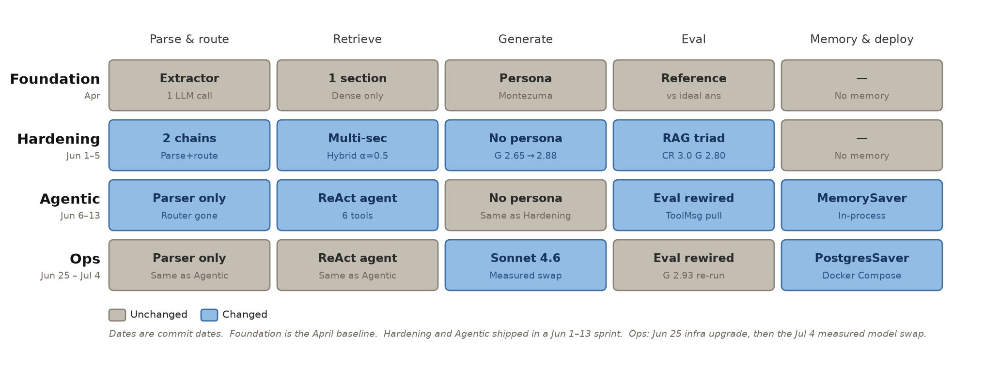

# Architecture: V1 → V5

This is the decision log behind the civ-rag-pipeline: what problem forced each change, what alternative was considered and rejected, and what the evaluation harness measured before and after. The companion diagram and quick-reference table are in the [main README](../README.md).

**On the phase labels.** Foundation, Hardening, Agentic, and Ops are retrospective narrative groupings, not commit tags — they were never named as phases while the work was happening. Checked against the actual commit history, the work falls into an **April baseline** (Foundation: Apr 18–29 — single-call extractor, single-section dense retrieval, reference-based eval, the Montezuma persona, and a Chroma→Pinecone migration), a **June 1–5 hardening sprint** (Hardening: the RAG triad, multi-section parallel + hybrid retrieval, persona removal, the two-chain split, and eval hardening), a **June 6–13 agentic experiment** (Agentic: the ReAct agent with memory, the eval breaking and being rewired, and structured logging — the logging commit is the Jun 13 tail), and a **June 25 – July 4 operations phase** (Ops: replacing `MemorySaver` with `PostgresSaver` and containerizing the app with Docker Compose — no pipeline stage changes — then a July 4 measured model swap to Sonnet 4.6). The dates and commit hashes in each entry below are the ground truth.

**Mechanics vs. scores.** Everything about *how the code works* in the entries below is verified against the actual commit diffs. The eval *scores* (CR/G/AR numbers) come from recorded eval runs captured in development notes, not from the diffs, which contain code rather than results — so treat the mechanics as exact and the numbers as reported-from-notes.

**Eval scores across versions:**

| Phase | Eval approach | Questions | Scores |
|---|---|---|---|
| Foundation | Reference-based (Faithfulness + Relevance vs ideal answers) | 20 baseline → 18 final | F 2.20 / R 2.40 baseline → R 2.89 after a routing fix; 5 → 0 retrieval failures |
| Hardening | RAG triad (CR / G / AR), hardened — AR vs ideal answer | 15 | CR 3.0 / G 2.80 / AR 2.93 |
| Agentic | RAG triad, rewired for agent (ToolMessage extraction) | 15 | CR 3.0 / G 2.73 / AR 2.80 |
| Ops | RAG triad, same harness; Jul 4 model swap to Sonnet 4.6 | 15 | CR 3.00 / G 2.93 / AR 2.93 |

*Foundation's scores aren't directly comparable to the triad scores — they measure against ideal answers rather than retrieved chunks. The metric change is itself part of the story: a shift from "is the output good?" to "which stage failed and why?"*

## Contents

**Foundation (April)**
- [Extractor: one combined LLM call](#extractor-one-combined-llm-call)
- [1 section, dense only](#1-section-dense-only)
- [Persona: the Montezuma voice](#persona-the-montezuma-voice)
- [Reference eval: faithfulness and relevance vs ideal answers](#reference-eval-faithfulness-and-relevance-vs-ideal-answers)

**Hardening (Jun 1–5)**
- [2 chains: splitting parser and router](#2-chains-splitting-parser-and-router)
- [Multi-section retrieval with hybrid search](#multi-section-retrieval-with-hybrid-search)
- [RAG triad: context relevance, groundedness, answer relevance](#rag-triad-context-relevance-groundedness-answer-relevance)
- [Persona removed: the controlled experiment](#persona-removed-the-controlled-experiment)
- [Hardening the triad: eval set cleanup and the answer relevance fix](#hardening-the-triad-eval-set-cleanup-and-the-answer-relevance-fix)

**Agentic (Jun 6–13)**
- [Parser only: router deleted for the ReAct agent](#parser-only-router-deleted-for-the-react-agent)
- [ReAct agent with 6 tools and cross-session memory](#react-agent-with-6-tools-and-cross-session-memory)
- [The eval breaks: what going agentic costs you](#the-eval-breaks-what-going-agentic-costs-you)
- [Eval rewired: ToolMessage extraction plus structured logging](#eval-rewired-toolmessage-extraction-plus-structured-logging)

**Ops (Jun 25 – Jul 4)**
- [Persistent memory and containerization: PostgresSaver + Docker Compose](#persistent-memory-and-containerization-postgressaver--docker-compose)
- [Prior-override investigation: the measured model swap](#prior-override-investigation-the-measured-model-swap)

---

## Extractor: one combined LLM call

*(April baseline)*

The pipeline started with a single `version_extractor` chain that cleaned the query, extracted the target BBG version, and routed to a content section — all in one LLM call and one prompt. It was the fastest way to ship a working pipeline and prove the retrieval concept end to end before investing in a more elaborate parsing architecture.

**What it cost:** combining three responsibilities into one call meant a failure in one (e.g. section routing) was indistinguishable from a failure in another, and hard to diagnose. Missing few-shot examples caused two specific misroutes — see [reference eval](#reference-eval-faithfulness-and-relevance-vs-ideal-answers) below — which is what eventually motivated [splitting the extractor into two chains](#2-chains-splitting-parser-and-router).

## 1 section, dense only

*(Apr 22 – Apr 28, 2026 — before the two-agent split. Verified against the actual commit diffs, not reconstructed from notes, so the dates and mechanics below are exact.)*

The retriever started simpler than even this heading implies, and evolved in three concrete steps while the single-call extractor was still in place — well before the bigger two-agent rewrite below.

**Apr 22 — `section_hint` added, three-branch priority logic.** The retriever gained a `section_hint` parameter alongside the existing `version` parameter. If `version` is given, filter to that version only — `section_hint` is ignored even if present. If `version` is absent but `section_hint` is given, filter to that section only. If neither is available, fall back to an unfiltered search excluding the `names` section (a 17k-document slice of pure lookup data that otherwise dominated the similarity ranking), with `k` bumped from 25 to 40 to compensate for the wider search space. Two of the three branches use the default k=25; only the worst case gets the wider k.

**Apr 24 — version and section combine instead of one overriding the other.** A fourth branch was added: when both `version` and `section_hint` are present, they're combined with an `$and` filter instead of `version` silently discarding the section information. Before this fix, a query that correctly resolved to "version 7.3, asking about units" would search all of 7.3 unfiltered by section — a real, if short-lived, gap.

**Apr 28 — Chroma to Pinecone, plus dedup and version pruning.** `Chroma` (local, file-backed) was swapped for `PineconeVectorStore` (hosted, reading the index name from an environment variable), the filter syntax moved to Pinecone's operators (`$in`, `$eq`), and the same commit deduplicated entries and pruned some BBG versions — which is also why the docstring's specific document counts ("~2,400 docs," "32k to ~1,980 docs for units") were trimmed out here: they'd gone stale.

**What this didn't solve:** even with version and section combinable, the design could still only filter to *one* section string at a time. A query needing two sections simultaneously — "which civilization has the Ice Hockey Rink?" needs both `improvements` and `leaders` — had no way to express that. That gap, not the version/section logic above, is what motivated the move to list-based section routing and parallel retrieval next. See [multi-section retrieval](#multi-section-retrieval-with-hybrid-search).

## Persona: the Montezuma voice

*(April baseline → removed Jun 2)*

Responses were generated in a Montezuma persona for tone and flavor — the generation prompt opened with "You are Montezuma of the Aztec people and also an expert in the game of Civilization 6."

**What it cost:** the persona encouraged the model to add color beyond what the retrieved chunks supported — fabricated version numbers and, in one case, a mod name that doesn't exist. See [persona removed](#persona-removed-the-controlled-experiment) for how this was confirmed and fixed.

## Reference eval: faithfulness and relevance vs ideal answers

*(April baseline — `ae1796d`, Apr 25)*

The first eval scored generated responses against hand-written ideal answers on two metrics, Faithfulness and Relevance, in a single `judge_response` LLM call on a 1–3 scale across 20 questions. The same call also returned a structured reasoning field alongside the two scores — so reading the judge's rationale, not just the number, was built into the eval from the very first version. Baseline: Faithfulness 2.20, Relevance 2.40, with 5 complete retrieval failures (roughly a quarter of the set returning "I don't have information about that"). Two questions were later dropped as unsolvable within the V1 architecture, bringing the final V1 set to 18. 

Root cause was missing few-shot routing examples in the extractor prompt — questions about the Migration Treaty were misrouting to `misc`, and questions about BBG Expanded were misrouting to `changelog`. Adding targeted examples for both eliminated all five failures and moved Relevance to 2.89.

**The limitation that motivated the triad:** both Faithfulness and Relevance compared the response against the ideal answer -- neither received the retrieved chunks as input. Without the chunks, the judge fell back on its training data to evaluate whether claims were "supported." That means a hallucination that happened to agree with the model's training knowledge could score a 3 on Faithfulness. The eval wasn't measuring RAG quality -- it was measuring agreement with training data. A retrieval failure and a hallucination produced an identical low score either way, with no signal about which stage failed. The triad's contribution was to give Groundedness the retrieved chunks directly as input, so it scores against what the model actually saw rather than training knowledge or an ideal answer. A low Groundedness score with high Context Relevance points at generation; a low Context Relevance score points at retrieval. That localization is what the RAG triad was built to provide.

## 2 chains: splitting parser and router

*(efa6f96 — May 31, 9:27pm, the evening before the Jun 1 sprint)*

The single extractor was split into two chains with separate responsibilities: a Query Parser that cleans the query and extracts the target version, and a Section Router that classifies which content section(s) the query targets — returning a *list*, not a single value, which is what made multi-section retrieval possible downstream. This commit's message is "split extractor into 2 different llm responsibilities," and at 9:27pm on May 31 it's the opening move of the June sprint rather than an isolated mid-gap cleanup — the two-chains split, the next-day parallel fan-out, and the hybrid retrieval that night all landed in close sequence.

**Rejected alternative:** keeping a single chain and just improving its prompt. Rejected because the underlying problem wasn't prompt quality — it was that two unrelated responsibilities shared one failure surface, where a routing fix could silently break version extraction and vice versa.

## Multi-section retrieval with hybrid search

*(Jun 1 — `d3026e1` fan-out, `9cf1797` hybrid + BBG v7.5)*

This shipped in two commits on the same day, in this order:

**`d3026e1` (17:49) — parallel fan-out, still dense-only.** A LangGraph supervisor (`supervise_retrieval`) fans out one retrieval call per routed section using the `Send` API — verified in the diff: it returns a list of `Send("retriever", {...})`, one per section in `section_hints`, or a single `Send` with `current_section=None` when there are none. Each `retrieval` node returns `{"documents": result}` and LangGraph merges the parallel writes via the `documents: Annotated[list[Document], operator.add]` annotation on `RetrieverState` — confirmed in `schema.py` at `d3026e1`. At this commit retrieval was still `vector_store.similarity_search(...)` through the LangChain `PineconeVectorStore` wrapper — dense-only.

**`9cf1797` (23:37) — hybrid BM25 + dense.** Later that night, `hybrid_query()` replaced `similarity_search`. This dropped the LangChain `PineconeVectorStore` wrapper for the raw `Pinecone` client and `index.query(...)`, sending both a dense `vector=` and a `sparse_vector=`. The fusion is **alpha-weighted, not RRF**: the dense vector is scaled by `ALPHA` and the sparse vector by `1 - ALPHA` (`ALPHA = 0.5`, equal weight), then handed to Pinecone's native sparse-dense hybrid query in a single call. There is no reciprocal-rank step and no rank constant anywhere in the code. The same commit ingested BBG v7.5 into a new index (`PINECONE_INDEX_NAME_V2`).

**Why hybrid:** dense embeddings can miss exact game terminology — "Eagle Warrior" or "Ancestral Hall" — when the embedding drifts toward a semantically related but wrong concept. BM25 catches exact terms; dense catches paraphrased or conceptual queries. They fail in opposite directions, so both run and get combined.

**Why the raw `index.query()` instead of the LangChain `PineconeVectorStore`:** the wrapper has no way to send a sparse vector — it only does dense `similarity_search`. Hybrid search requires passing `sparse_vector=` directly, which only the raw Pinecone client exposes. (This is the corrected reason; an earlier draft attributed the switch to per-call metadata filters, but `similarity_search` handled those fine via its `filter=` argument — the real driver was sparse support.)

**Why alpha-weighting:** dense cosine-style scores and BM25 scores live on incompatible scales, so they can't simply be added. Scaling each by a weight that sums to 1 (`ALPHA` / `1 - ALPHA`) lets Pinecone's hybrid index combine them in a single retrieval, and `ALPHA` becomes a tunable dial between keyword precision and semantic recall. It was hardcoded to `0.5` here and pulled into config on Jun 6 (`6cd7252`).

**The index metric:** Pinecone's sparse-dense hybrid search only runs on a `dotproduct` index — it's a platform requirement, not a choice made in this file. So the working `hybrid_query()` confirms the index uses `dotproduct`, even though the metric itself is set at index-creation time in the ingester, which isn't shown in these diffs.

Measured impact: context relevance reached 2.94 — near-perfect, hybrid retrieval working as intended. See [RAG triad](#rag-triad-context-relevance-groundedness-answer-relevance) below for the full before/after.

## RAG triad: context relevance, groundedness, answer relevance

*(Jun 1 — `d7ce7d5`)*

The reference-based eval was replaced with three independent LLM-as-judge evaluators, run in parallel via `asyncio.gather` (which is also when the eval runner's `main()` became async): Context Relevance (is the retrieved context sufficient to fully answer the query? — a partial answer scores 2, a complete one scores 3, so it grades sufficiency, not just topical relevance), Groundedness (is the response as a whole supported by those chunks?), and Answer Relevance (does the response address the question asked?). Groundedness specifically replaced Faithfulness, comparing against the *retrieved chunks* rather than an ideal answer — the fix for the April eval's blind spot.

**A detail worth getting right:** at the triad's birth, Answer Relevance judged the response against the *query* — `answer_relevance_judge(query, response)` — not against an ideal answer. It only switched to reference-based four days later (Jun 5) as a deliberate fix; see [hardening the triad](#hardening-the-triad-eval-set-cleanup-and-the-answer-relevance-fix). So the triad was not "two chunk-based judges plus one reference-based judge" from the start — that asymmetry was introduced on purpose, in response to a specific failure, rather than designed in up front.

Scores at the end of the Jun 1 sprint (17 questions, after hybrid retrieval landed): CR 2.94 / G 2.65 / AR 2.88. The literal first triad run at `d7ce7d5`, still on dense-only retrieval, scored CR 2.88 / G 2.59 / AR 2.82 — hybrid is what moved CR to 2.94. High context relevance paired with low groundedness pointed directly at generation — specifically the persona — as the source of the remaining failures, rather than retrieval. That diagnostic precision is the entire value of the triad over a single blended score.

## Persona removed: the controlled experiment

*(Jun 2 — `c64bc7f`, "Removed persona because of failing grounding eval scores")*

The Montezuma persona was a *hypothesis* for the groundedness failures, not an assumed cause. Rather than rewriting the prompt speculatively, the persona was removed and the eval re-run. The change itself is exactly one line — the prompt's opening went from "You are Montezuma of the Aztec people and also an expert in the game of Civilization 6" to "You are an expert in the game of Civilization 6," nothing else touched. Groundedness moved 2.65 → 2.88 (confirmed from `judgment.csv` at `c64bc7f`, 17 questions: CR 2.94 / G 2.88 / AR 2.88). Two remaining groundedness failures were a source-data conflict (two document versions describing the same ability differently) and a cross-version fabrication issue — the latter a known architectural limitation, not something a prompt change can fix. Notes in the eval code at the time pinned part of that cross-version issue to retrieval, not generation: groundedness was flagging version-provenance claims as unsupported precisely when the relevant version chunk hadn't been retrieved — so the fix lives in version-scoped retrieval, not the prompt. Removing the persona resolved the generation-side fabrication, but a retrieval-side cause for the remainder was left as an open thread.

The takeaway for an interview: the discipline here isn't "removed the persona," it's "treated a prompt element as a hypothesis and used the eval as the test" — a one-line change, isolated and measured, rather than a speculative rewrite bundled with other edits.

## Hardening the triad: eval set cleanup and the answer relevance fix

*(Jun 5 — `631fac8` "eval adjustments")*

Two fixes, several days after the persona removal. First, the Answer Relevance judge was switched from judging against the query to judging against an ideal answer — the literal change was `answer_relevance_judge(query, response)` becoming `answer_relevance_judge(ideal_answer, response)`, and the same commit un-commented the `ideal_answer` field back into the eval-file parser to feed it. The motivation: a query-only judge has no domain context and defaults to real-world knowledge as its baseline — it penalized "Who is Alan Turing?" for not mentioning codebreaking, which is irrelevant in a Civ 6 context. Rewording that question to scope it to game mechanics was part of the same cleanup.

Second, the eval set itself had structural problems independent of the judges: questions with multiple valid answers (dropped), an ideal answer narrower than the game mechanic it described (reworded), and a genuine source-data discrepancy isolated by querying the vector store directly rather than assumed to be a generation error.

Final scores (15 cleaned questions): CR 3.0 / G 2.80 / AR 2.93.

## Parser only: router deleted for the ReAct agent

*(Jun 6 — `6ebb6551`)*

The Section Router chain was deleted entirely. The remaining Query Parser still cleans the query and extracts the version, but section routing is now handled implicitly by the ReAct agent choosing which tools to call.

## ReAct agent with 6 tools and cross-session memory

*(Jun 6 — `6ebb6551`, "replace graph pipeline with ReAct agent in generate_response")*

The deterministic LangGraph supervisor was replaced with a `create_react_agent` selecting from six typed tools, each wrapping the hybrid retrieval function with a section filter: units, leaders, great people, techs & civics, buildings & improvements, and a general catch-all. The agent reasons at runtime from each tool's description rather than following a pre-classified route. The diff is a clean swap: the old `graph.invoke(...)` call plus a hand-built `ChatPromptTemplate` and `cpt | llm | StrOutputParser()` generation step were all deleted and replaced with a single `agent.invoke(...)`.

**Sequencing worth being precise about:** this landed *after* the triad (Jun 1) and *after* the persona removal (Jun 2) — the agentic rewrite was not the foundation the eval work was built on, it came on top of an already-measured, already-cleaned pipeline. That ordering matters in an interview, because it means the agent's quality could be compared against a known-good deterministic baseline rather than guessed at.

**Rejected alternative:** keep improving the deterministic router's classification examples. Rejected because deterministic routing has a hard ceiling — it only handles query patterns someone thought to write an example for. An agent that reasons at runtime doesn't have that ceiling.

**What it cost:** less predictability and a runaway-cost risk, bounded with a per-turn recursion limit, a per-tool retrieval cap, and a per-chunk content size limit (the limits were pulled into config shortly after, in `6cd7252`). The recursion limit later bit a real query: on Jun 20 (`7bcef6d`) a multi-section question exhausted `recursion_limit: 10` and crashed with a `GraphRecursionError`. Each tool call costs two graph super-steps — the model's decision to call the tool, then the tool execution — so 10 only bought roughly 4 tool calls. The limit was raised to 25 (LangGraph's default, roughly 12 tool calls) and `agent.invoke` wrapped in a try/except that returns a graceful message on a caught `GraphRecursionError`; the ceiling is headroom, the catch is the real guard.

The agent's state management also made cross-session memory a small addition rather than a rewrite, and the diff confirms they arrived in the *same commit*: `generate_response` gained a `thread_id` parameter and a `RECURSION_LIMIT` config in exactly the change that introduced the agent. A `MemorySaver` checkpointer keyed by `thread_id` persists conversation state across turns and sessions — a different memory mechanism, and a different scope, than the supervisor's reducer, which only accumulated results *within* a single query.

## The eval breaks: what going agentic costs you

*(Jun 6 → Jun 12 — broken by `6ebb6551`, fixed by `600f839`)*

Going agentic broke the eval pipeline, and that's a deliberate inclusion in this log rather than a detail to gloss over. The diff makes the mechanism exact: in the same Jun 6 commit that introduced the agent, `generate_response`'s return type went from `tuple[str, list[Document]]` down to just `str`. The ReAct agent consumes retrieved documents inside its own reasoning loop, so the documents were no longer a return value — and the Context Relevance and Groundedness judges, which take those documents as input, had nothing to score. For six days (Jun 6–12) the eval simply couldn't run.

Re-measured scores on this architecture once the eval was restored (see next entry): CR 3.0 / G 2.73 / AR 2.80 — close to the Jun 5 numbers, with the small dip expected since those gains included a carefully cleaned eval set and persona removal already baked in.

**Interactive testing surfaced a failure mode the scores understate.** In live use, the agent frequently substitutes Civ 5 training data for retrieved Civ 6 content without any signal of uncertainty — a confident wrong answer. Canonical example: ask for the Aztec unique unit in BBG 7.5; the agent returns "Jaguar" (the Civ 5 Aztec unique unit). The retrieved chunk containing "Eagle Warrior" is present in the tool outputs — retrieval is not the failure. A single "Are you sure?" follow-up is enough: the agent re-reads the same retrieved chunk and self-corrects to "Eagle Warrior." The mechanism is not a retrieval gap; it is a generation failure rooted in the architecture. From the model's perspective, retrieved tokens and training tokens are indistinguishable in the context window — a confident training prior wins when the prior is strong. Prompt instructions telling the model to prefer retrieved content fight that prior but cannot reliably override it. The deterministic pipeline did not share this failure mode: chunks went directly into a constrained generation call and the model only ever saw the retrieved content, with no competing reasoning path where training knowledge could surface. This finding, not the groundedness delta alone, drove the decision-making that followed: initially a revert decision, later overturned by measurement (see "Prior-override investigation: the measured model swap" below).

## Eval rewired: ToolMessage extraction plus structured logging

*(Jun 12 — `600f839`, "eval pipeline fixed"; Jun 13 — `2f67b3a`, "added structured logging to ingester")*

Two changes across consecutive days. First, in `600f839`, the eval pipeline was rewired around `ToolMessage` objects in the agent's message history. The fix pulls them out with `[m.content for m in result["messages"] if isinstance(m, ToolMessage)]` — those contents hold the exact string each tool returned, which is precisely what the LLM saw and the correct input for a groundedness check. Note the return type became `tuple[str, list[str]]`, not `list[Document]` as before the agent — tool outputs are already-formatted strings, so the judges were updated to consume strings. The same commit also generates a fresh `thread_id` per eval question (`str(uuid4())`) so the agent's cross-session memory doesn't bleed context from one eval question into the next and quietly inflate scores.

Second, the next day in `2f67b3a`, the ingester gained structured JSON logging (consistent fields per log line: batch number, size, sections, versions, status, error type) and per-batch error handling, so a single Pinecone timeout no longer kills the entire ingestion run. In production, those logs would ship to a log aggregator — filtering by `status=error` and grouping by `error_type` separates a data-quality problem (failures concentrated in one section) from a connectivity problem (failures scattered across batches).

## Persistent memory and containerization: PostgresSaver + Docker Compose

*(Jun 25)*

With the pipeline stages stable at V5, the next gap was operational: `MemorySaver` stores conversation state in a Python dict that lives and dies with the process. A container restart — or any deployment that stops and restarts the app — wipes all conversation history. That's an acceptable constraint for a demo but a real limitation for anyone using the chatbot across multiple sessions, and a gap that would surface immediately in any technical review.

**What changed.** `MemorySaver` in `construct_agents.py` was replaced with `PostgresSaver` from `langgraph-checkpoint-postgres`, backed by a Postgres database running as a Docker Compose sidecar service. The app itself was containerized with a `Dockerfile` and `docker-compose.yml`, so the full stack — app plus database — spins up with `docker compose up`.

**Dockerfile decisions worth being precise about.** The `uv` binary is copied from the official `ghcr.io/astral-sh/uv:latest` image via a multi-stage `--from` copy rather than installed at runtime. `pyproject.toml` and `uv.lock` are copied before source files so the `uv sync` layer is cached as long as dependencies haven't changed — editing source code doesn't trigger a dependency reinstall. `CMD` uses exec form (`CMD ["uv", "run", "streamlit", "run", "app.py", ...]`) rather than shell form so the process runs as PID 1 and receives signals correctly on `docker stop`. The Streamlit server binds to `0.0.0.0` explicitly — binding to `localhost` inside a container makes the port unreachable from the host even with `-p` published.

**Compose decisions.** Two services: `app` (built from the Dockerfile) and `db` (postgres:16). Docker Compose puts both on a shared network automatically, so `app` connects to Postgres via the service name `db` rather than `localhost`. `depends_on` uses `condition: service_healthy` with a `pg_isready` healthcheck — plain `depends_on` only waits for the container to start, not for Postgres to be ready to accept connections, and the gap causes `connection refused` on fast machines. A named volume (`pgdata`) persists the database across `docker compose restart`; it's only dropped with `docker compose down -v`.

**PostgresSaver specifics.** The checkpointer requires `autocommit=True` and `row_factory=dict_row` on the psycopg connection. The `dict_row` argument triggers a basedpyright type error (a known stub gap in psycopg, not a runtime issue) suppressed with `# pyright: ignore[reportArgumentType]`. `checkpointer.setup()` creates the four required tables (`checkpoints`, `checkpoint_blobs`, `checkpoint_migrations`, `checkpoint_writes`) on first run; it's safe to call every startup. `DATABASE_URL` is injected at runtime — set in the app service's `environment:` block in Compose for the local stack (throwaway local credentials), while the API keys arrive via `env_file: .env`. Nothing is baked into the image, and `.env` is excluded from the build context via `.dockerignore`.

**Local dev fallback.** When `DATABASE_URL` is not set, `construct_agents.py` falls back to `MemorySaver`. This keeps local development outside Docker frictionless without a second code path.

**What PostgresSaver actually gives vs MemorySaver.** Memory survives container restarts — confirmed: checkpoints are written to the named volume and readable after `docker compose restart app`. Each `thread_id` is isolated in Postgres, which makes the app structurally multi-user ready. The checkpoint tables are inspectable directly (`SELECT * FROM checkpoints`), which matters for debugging — you can see exactly what the agent persisted after any turn.

**What it does not give yet.** True cross-session persistence for a returning user. `thread_id` is still generated fresh per Streamlit session (`str(uuid4())` in `app.py`), so a returning user gets a blank slate even though their prior conversation exists in Postgres. Fixing that requires persisting the `thread_id` to a cookie or query param — it's the noted next step, not an oversight.

**Rejected alternative.** Keep `MemorySaver` and accept the restart-wipe behavior. Rejected because it's a defensibility gap: any reviewer who asks "what happens to conversation state when you redeploy?" gets a weak answer. PostgresSaver closes that gap cleanly and the Docker Compose work was already happening to containerize the app anyway.

## Prior-override investigation: the measured model swap

*(Jul 4 — probe scripts in `evaluation/`; Haiku eval baseline preserved in `evaluation/judgment_haiku_agentic_baseline.csv`)*

The training-data override documented above ("The eval breaks") initially drove a revert decision: the deterministic pipeline removes the reasoning loop where a training prior can beat a retrieved chunk, and that guarantee is model-independent. Before shipping the revert, the counter-hypothesis (is this failure just model capability?) was tested properly. The result overturned the decision.

**Ruling out prompting.** The canonical probe (`evaluation/prior_override_probe.py`: fresh thread, "What is the Aztec unique unit in version 7.5?", then "Are you sure?") measured Haiku wrong in 9 of 10 fresh sessions on the shipped prompt. Anchoring the system prompt with "every question is about Civilization 6 BBG, never any other game" made it 10 of 10 wrong. The challenge recovered the correct answer in every session. Prompting is ruled out by measurement, not by exhaustion.

**The probe trap.** Sonnet 4.6 passes the canonical probe 10 of 10, and by itself that proves nothing: Eagle Warrior is also the vanilla Civ 6 answer, so a correct answer can be prior agreement rather than grounding. This is the same blind spot that motivated the RAG triad (see "The limitation that motivated the triad" above), reappearing in probe design. On a public corpus, grounding and prior knowledge overlap; a discriminating probe must use facts where the corpus disagrees with training data.

**The discriminating probe.** BBG stat values diverge from vanilla (Warrior production cost 20 vs 40; Scout 15 vs 30; Eagle Warrior 32 vs 65; Knight melee strength 50 vs 48). Raw Sonnet with no retrieval answers from its prior, 12 of 12, wrong for this corpus. Through the pipeline, 12 of 12 grounded. Pipeline Haiku also grounds those stats 12 of 12; raw Haiku produces no corpus values (`evaluation/divergent_probe.py`, `evaluation/anchor_probe.py`).

**Refined mechanism.** Prior-vs-context arbitration is capability-dependent and prior-strength-dependent. Haiku grounds facts where its prior is weak and loses only where its prior is confidently wrong (the Jaguar case), regardless of prompting. Sonnet overrides even its own confidently wrong priors.

**The eval.** Full RAG triad with Sonnet as the agent model: CR 3.00 / G 2.93 / AR 2.93, versus 3.00 / 2.73 / 2.80 on Haiku agentic and 3.0 / 2.80 / 2.93 on the Hardening deterministic baseline. Groundedness on the agentic build now exceeds the deterministic baseline.

**Rejected alternative: the revert itself.** It was the right call on the earlier data and was documented as such; it was superseded when the measurements above landed. It remains the architecture to A/B first under cost constraints or for correctness-critical deployments, because it earns groundedness structurally (constrained generation, no contest) instead of paying for capability.

**What it cost:** 3x per token (Sonnet 4.6 at $3/$15 per million tokens in/out, versus Haiku 4.5 at $1/$5).
